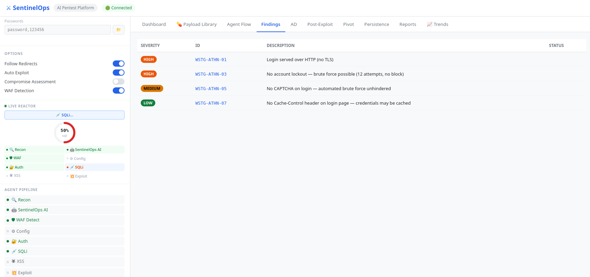
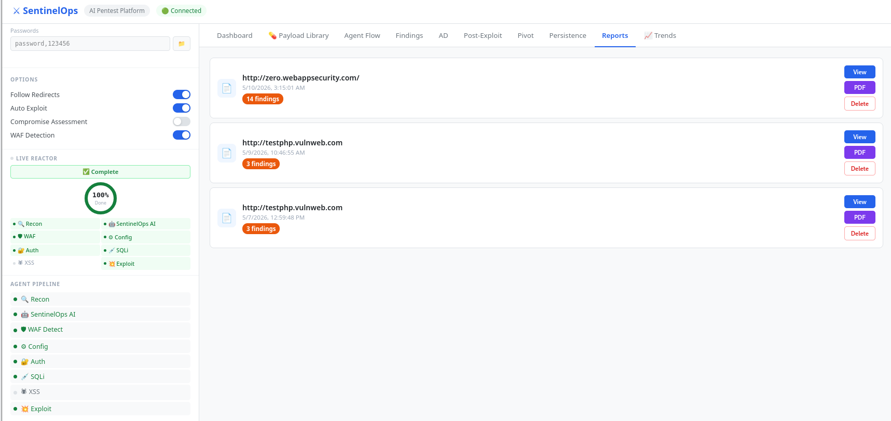

# 🛡️ SentinelOps — AI-Guided Penetration Testing Platform

> **An autonomous AI pentest platform that thinks like a hacker.**  
> SentinelOps uses a local LLM to route intelligent agents, run 120+ WSTG tests, and generate professional compliance-mapped reports — all from a single dashboard.

---

## 🎥 Demo

https://github.com/SakethReddy-07/SentinelOps/raw/main/POC.mp4

---

## ✨ What Makes SentinelOps Different

Most scanners run the same checks every time. SentinelOps uses an **AI agent router** that reads live findings and decides which agents to run next — just like a real pentester would escalate based on what they find.

---

## 🚀 Features

### 🤖 AI-Guided Agent Router
- Routes 24 specialized agents intelligently based on live findings
- Powered by `xploiter/pentester` via Ollama (free, runs fully offline)
- Falls back to smart rule-based routing — no API key required
- Escalates to deeper tests automatically when HIGH/CRITICAL findings appear

### 🔍 24 Scanning Agents

| Category | Agents |
|---|---|
| Recon | Info gathering, subdomain enum (amass + subfinder + theHarvester), OSINT, cloud assets |
| Web Testing | WAF detect/bypass, Input validation (SQLi/XSS/CMDi/SSTI/LFI/XXE), Auth, Session, SSRF |
| Authorization | IDOR, privilege escalation (4 techniques), OAuth, horizontal privesc |
| API Security | GraphQL introspection, REST discovery, BOLA, JWT attacks, mass assignment |
| Infrastructure | SSL/TLS, Network scanning, CVE scanning with NVD auto-update |
| Advanced | Rate limiting (7 tests), Business logic, Credentialed scanning, Compromise assessment |
| Post-Exploit | Shell execution, privilege escalation, credential harvesting, persistence detection |

### 💊 Payload Library
- **40,378 payloads** across SQLi, XSS, CMDi, JWT, LFI, LDAP, SSRF, SSTI, XXE, WAF bypass
- Labelled by database/technique (MySQL, MSSQL, Oracle, Auth Bypass, DOM XSS, etc.)
- Search, filter by category, export selected payloads

### 📊 Professional Reports
- Executive HTML report with risk score, CVSS scoring, kill chain
- Auto-tagged to **5 compliance frameworks**: OWASP Top 10, PCI-DSS v4.0, NIST 800-53, HIPAA, GDPR
- PDF export with full finding details and remediation guidance
- Scan diff engine — surfaces new vs fixed vs recurring findings across scans

### 📈 Platform Features
- **Scheduled scans** — cron-based continuous monitoring with regression detection
- **Trend charts** — severity over time, per-target scan history
- **Alerting** — instant Slack/email push for CRITICAL/HIGH findings
- **False positive management** — mark, suppress, persist across future scans
- **Persistent scan history** — survives server restarts, full audit trail

### 🔗 Integrations
- Metasploit RPC — auto-exploit confirmed vulnerabilities
- Burp Suite — export/import proxy traffic
- nmap + 612 NSE scripts
- sslscan, sslyze, nikto, nuclei, sqlmap, gobuster, hydra, amass, subfinder, theHarvester
- YARA rules for malware/IOC detection

---

## 🛠️ Tech Stack

| Layer | Technology |
|---|---|
| Backend | Python, Flask, Flask-SocketIO |
| AI Router | Ollama (`xploiter/pentester` 1.6B — runs offline, free) |
| Frontend | Vanilla JS, Chart.js, Socket.IO (real-time live log) |
| Security Tools | nmap, sqlmap, nikto, nuclei, gobuster, hydra, amass, subfinder, theHarvester, sslscan, sslyze, Metasploit |
| Reporting | HTML, PDF (ReportLab), JSON |
| Frameworks | OWASP WSTG, OWASP Top 10, PCI-DSS v4.0, NIST 800-53, HIPAA, GDPR |

---

## 📸 Screenshots

### 🖥️ Dashboard — Live Scan Log

### 🔄 Agent Flow Diagram

### 🎯 Findings Table

### 💊 Payload Library — 40,378 Payloads

### 📋 Reports List

### 📄 Executive Security Report (PDF)

---

## ⚠️ Legal Disclaimer

SentinelOps is built for **authorized security testing only**.  
Always obtain explicit written permission before scanning any target.  
The author is not responsible for any unauthorized or illegal use of this tool.

---

## 👤 Author

**Saketh Reddy**  

---

⭐ **Star this repo if you found it useful!**
